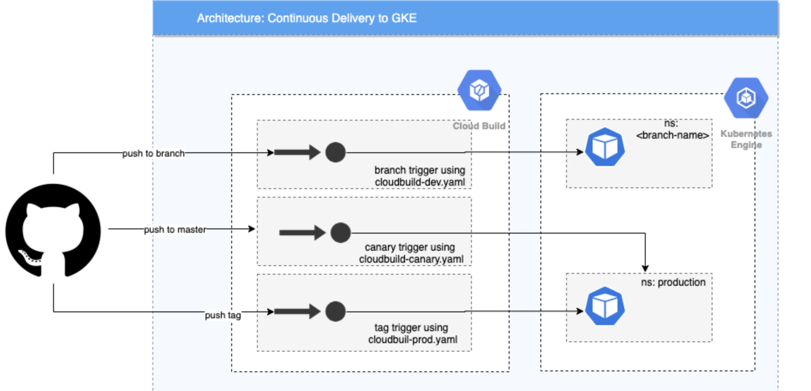

# Spring Boot GKE deployment

This repository holds scripts demonstrating how to use Google Cloud Build as a Continuous Deployment 
system to deploy a SpringBoot application to GKE.

## Architecture



#### How it works
There are triggers set up within Google Cloud Build which watch the GitHub repository. When a code push activates one of
the triggers, the relevant cloudbuild.yaml file used to submit a build to Cloud Build. This then deploys the application
to the relevant GKE namespace.

- Push to master --> cloudbuild-canary.yaml --> deploy a second pod to Production
- Push a tag --> cloudbuild-production.yaml --> deploy a new production version
- Push to a branch --> cloudbuild-dev.yaml --> deploy a new namespace

To set up CD follow these commands from the gcp cloud shell:

## Setting it up 

### Configure GCP environment

```
    export PROJECT=$(gcloud info --format='value(config.project)')
    export CLUSTER=gke-deploy-cluster
    export ZONE=europe-west1-b

    gcloud config set compute/zone $ZONE
```

#### Enable Services
```
gcloud services enable container.googleapis.com --async
gcloud services enable containerregistry.googleapis.com --async
gcloud services enable cloudbuild.googleapis.com --async
gcloud services enable sourcerepo.googleapis.com --async
```
#### Create Container Cluster

```
gcloud container clusters create ${CLUSTER} \
--project=${PROJECT} \
--zone=${ZONE} \
--quiet
```

#### Get Credentials

```
gcloud container clusters get-credentials ${CLUSTER} \
--project=${PROJECT} \
--zone=${ZONE}
```

#### Give Cloud Build Rights

For `kubectl` commands against GKE youll need to give Cloud Build Service Account container.developer role access 
on your clusters [details](https://github.com/GoogleCloudPlatform/cloud-builders/tree/master/kubectl).

```
PROJECT_NUMBER="$(gcloud projects describe \
    $(gcloud config get-value core/project -q) --format='get(projectNumber)')"

gcloud projects add-iam-policy-binding ${PROJECT} \
    --member=serviceAccount:${PROJECT_NUMBER}@cloudbuild.gserviceaccount.com \
    --role=roles/container.developer

```

### Create repo mapping with Cloud Build & GitHub
1. In the GCP UI navigate to Cloud Build --> Triggers --> Connect Repository.
2. Select Github 
3. Link your GitHub account and point to correct repository.
4. Connect (& Skip the first trigger it creates for you)

### Setup triggers
Cloud Build triggers which watch the source repository ang build the application when the required conditions
are met. Here we use 3 triggers which are stored within the gcp/triggers folder. To deploy them execute the 3 API calls 
bellow within folder gcp/triggers. If doing from Cloud Shell you will need to pull this repo into the shell so that you 
can access the files.

1. Push to a branch - creates a new cluster within the GKE service with the cluster name matching the 
branch name
2. Push to master branch - Creates a canary release
3. Push of a tag to master branch - deploys the code to production namespace in GKE

> *NOTE:* Change the values under github.owner and github.name within all the trigger.json files (in /gcp folder)
```
    curl -X POST \
        https://cloudbuild.googleapis.com/v1/projects/${PROJECT}/triggers \
        -H "Content-Type: application/json" \
        -H "Authorization: Bearer $(gcloud auth application-default print-access-token)" \
        --data-binary @branch-build-trigger.json

    curl -X POST \
        https://cloudbuild.googleapis.com/v1/projects/${PROJECT}/triggers \
        -H "Content-Type: application/json" \
        -H "Authorization: Bearer $(gcloud auth application-default print-access-token)" \
        --data-binary @master-build-trigger.json

    curl -X POST \
        https://cloudbuild.googleapis.com/v1/projects/${PROJECT}/triggers \
        -H "Content-Type: application/json" \
        -H "Authorization: Bearer $(gcloud auth application-default print-access-token)" \
        --data-binary @tag-build-trigger.json
```

Review triggers are setup on the [Build Triggers Page](https://console.cloud.google.com/gcr/triggers) 

### Create Database (WIP)

> *NOTE:* Having issues connecting the database to the application pod. Issue seems to be due to Cloud SQL proxy. 
> Application cannot build (as part of the Cloud Build step) as it cannot connect to the database.
>
> Error Seen in Cloud Build:
> 
>``The Application Default Credentials are not available. They are available if running in Google Compute Engine. 
Otherwise, the environment variable GOOGLE_APPLICATION_CREDENTIALS must be defined pointing to a file defining the 
credentials. See https://developers.google.com/accounts/docs/application-default-credentials for more information.``

This demo uses a postgreSQL database running on Cloud SQL which you have to deploy. Once the app starts, 
flyway will do the rest (create table + populate some data).

Set up database: 
```
gcloud sql instances create <DATABASE-NAME> --tier=db-n1-standard-1 --region=us-central1

gcloud sql users set-password root --host=% --instance <DATABASE-NAME> --password <PASSWORD>

gcloud sql databases create <TABLE-NAME> --instance=<DATABSE-NAME>
```
Get your database connection name:

```
gcloud sql instances describe test-instance-inventory-management | grep connectionName
```

#### Build & Deploy of local content (optional)

The following submits a build to Cloud Build and deploys the results to a user's namespace. (Note: username must consist of lower case 
alphanumeric characters or '-', and must start and end with an alphanumeric character (e.g. 'my-name',  or '123-abc', regex used for 
validation is '[a-z0-9]([-a-z0-9]*[a-z0-9])?'))

```
gcloud builds submit \
    --config gcp/builder/cloudbuild-local.yaml \
    --substitutions=_VERSION=[SOME-VERSION],_USER=$(whoami),_CLOUDSDK_COMPUTE_ZONE=${ZONE},_CLOUDSDK_CONTAINER_CLUSTER=${CLUSTER} .
```


