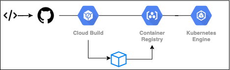

# Canary Deployment on Google Kubernetes Engine 

This repository holds scripts demonstrating how to use Google Cloud Build as a Continuous Deployment 
system to deploy a SpringBoot application to GKE.

## Architecture


#### Cloud Build

Cloud Build is a service which executes your builds directly on the GCP platform, using a build config file. The build 
is executed as a series of steps, with each step running in its own Docker container. Google has published a set of common 
[open-source build steps](https://github.com/googlecloudplatform/cloud-builders) for common laguages, has a range of 
[community-contributed steps](https://github.com/googlecloudplatform/cloud-builders-community) and also has functinality for 
you to [create your own](https://cloud.google.com/cloud-build/docs/configuring-builds/use-community-and-custom-builders) ones.

#### Cloud Build Triggers

Cloud Build Triggers are set up to watch a source code repository and automatically start a build whenever a change is 
pushed to the source code. In this example we use GitHub, but the porcess is the same for BitBucket and Google Cloud 
Source Repositories. The trigger can be configured to build your code on any detected change or when a change meets 
certain criteria. 

In this example we are configuring 3 triggers to act as follows:

- Push to master --> cloudbuild-canary.yaml --> deploy 1 pod to Production namespace
- Push a tag --> cloudbuild-production.yaml --> deploy 7 pods to Production namespace
- Push to a branch --> cloudbuild-dev.yaml --> deploy 1 pod to a new namespace

#### The Pipeline



All 3 triggers execute a similar version of the same pipeline, only difference being that they deploy to a different GKE
namespace. Nameley, a 'production' namespace and a 'dev' namespace. The pipleine follows 3 steps:

1. Build image using Dockerfile
2. Publish image to Google Container Registry
3. Depoloy image to Google Kubernetes Engine


# Setting up:

#### Configure GCP environment

```bash
## Configure env variables
PROJECT=$(gcloud info --format='value(config.project)')
CLUSTER=gke-deploy-cluster
ZONE=europe-west1-b
PROJECT_NUMBER="$(gcloud projects describe \
    $(gcloud config get-value core/project -q) --format='get(projectNumber)')"

gcloud config set compute/zone $ZONE

## Enable API Services
gcloud services enable container.googleapis.com --async
gcloud services enable containerregistry.googleapis.com --async
gcloud services enable cloudbuild.googleapis.com --async
```

#### Create GKE Container Cluster
In this example we will be deploying to different namespaces in the same GKE cluster. 

```bash
## Create the cluster
gcloud container clusters create ${CLUSTER} \
--project=${PROJECT} \
--zone=${ZONE} \
--quiet

#### Get Cluster Credentials
gcloud container clusters get-credentials ${CLUSTER} \
--project=${PROJECT} \
--zone=${ZONE}
```

#### Give Cloud Build Rights

For `kubectl` commands against GKE youll need to give Cloud Build Service Account container.developer role access 
on your clusters [details](https://github.com/GoogleCloudPlatform/cloud-builders/tree/master/kubectl). You can do this
in the IAM section of the GCP portal or with the following command:

```bash
gcloud projects add-iam-policy-binding ${PROJECT} \
    --member=serviceAccount:${PROJECT_NUMBER}@cloudbuild.gserviceaccount.com \
    --role=roles/container.developer
```

### Create repo mapping with Cloud Build & GitHub
1. In the GCP UI navigate to Cloud Build --> Triggers --> Connect Repository.
2. Select Github 
3. Link your GitHub account and point to correct repository.
4. Connect (& Skip the first trigger it creates for you)

### Setup triggers
Cloud Build triggers which watch the source repository ang build the application when the required conditions
are met. Here we use 3 triggers which are stored within the gcp/triggers folder. To deploy them execute the 3 API calls 
bellow within folder gcp/triggers. If doing from Cloud Shell you will need to pull this repo into the shell so that you 
can access the files.

1. Push to a branch - creates a new cluster within the GKE service with the cluster name matching the branch name
2. Push to master branch - Creates a canary release
3. Push of a tag to master branch - deploys the code to production namespace in GKE

> *NOTE:* Change the values under github.owner and github.name within all the trigger.json files (in /gcp folder)

```bash
    curl -X POST \
        https://cloudbuild.googleapis.com/v1/projects/${PROJECT}/triggers \
        -H "Content-Type: application/json" \
        -H "Authorization: Bearer $(gcloud auth application-default print-access-token)" \
        --data-binary @branch-build-trigger.json

    curl -X POST \
        https://cloudbuild.googleapis.com/v1/projects/${PROJECT}/triggers \
        -H "Content-Type: application/json" \
        -H "Authorization: Bearer $(gcloud auth application-default print-access-token)" \
        --data-binary @master-build-trigger.json

    curl -X POST \
        https://cloudbuild.googleapis.com/v1/projects/${PROJECT}/triggers \
        -H "Content-Type: application/json" \
        -H "Authorization: Bearer $(gcloud auth application-default print-access-token)" \
        --data-binary @tag-build-trigger.json
```

Review triggers are setup on the [Build Triggers Page](https://console.cloud.google.com/gcr/triggers) 

#### Execute
You have now built the GKE environment and configured the triggers. Pushing code to the repository should automatically
kick off the corresponding trigger and start a build in Cloud Build.